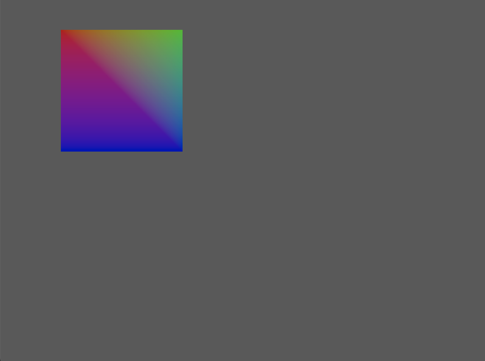

# toy2D

学习Vulkan时编写极简2D渲染器。

目前的效果：



我录制的[B站学习视频](https://www.bilibili.com/video/BV1R44y1M7e2?share_source=copy_web)

## 编译

使用CMake进行编译：

在Linux和MacOSX下，CMake会使用:


```cmake
find_package(SDL2 REQUIRED)
find_package(Vulkan REQUIRED)
```

来查找Vulkan和SDL2。如果没有查找到，那么会报错误。

并且需要指定SDL的头文件和库路径：

```text
SDL2_ROOT = D:/Program/3rdlibs/SDL2-2.0.22-VC
```

最后使用cmake进行编译即可：

```cmake
cmake -S . -B cmake-build
cmake --build cmake-build
```

生成的程序为`build/sandbox/sandbox.exe`


需要在根目录运行此程序（或者将spv文件放到程序的同一目录）
